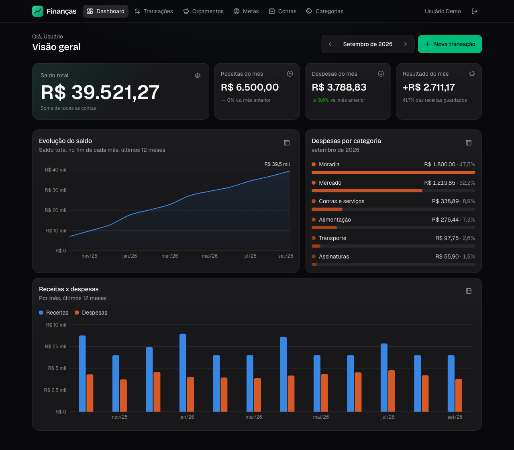
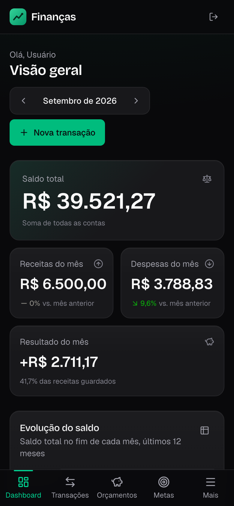
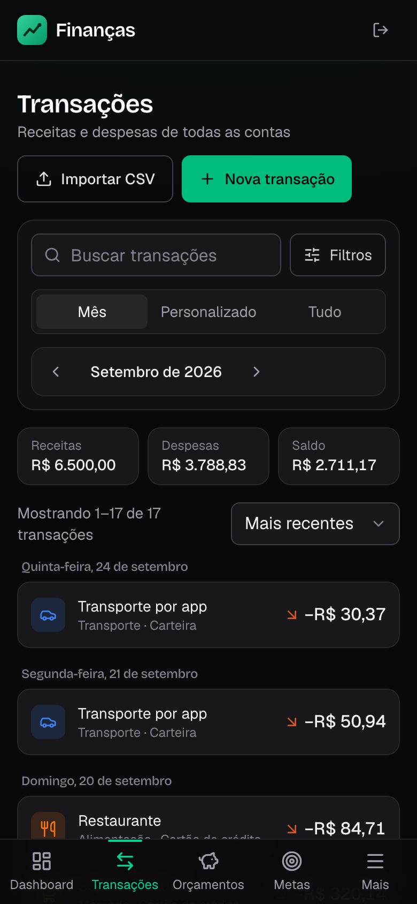
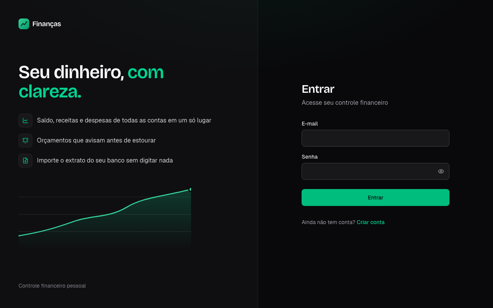
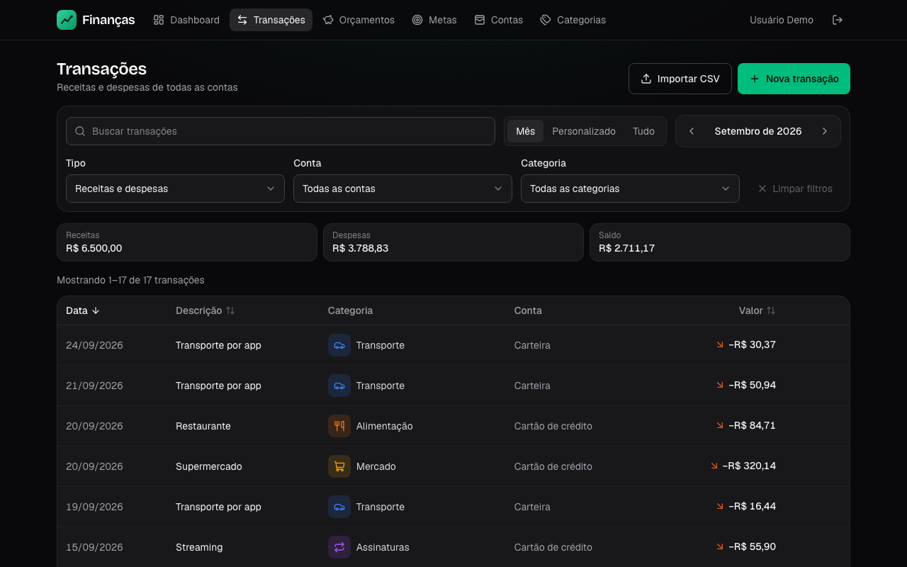
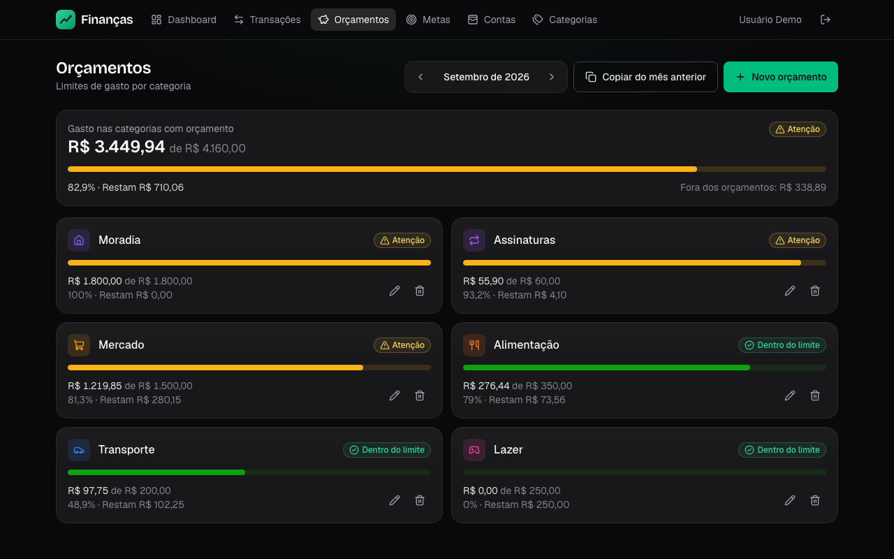
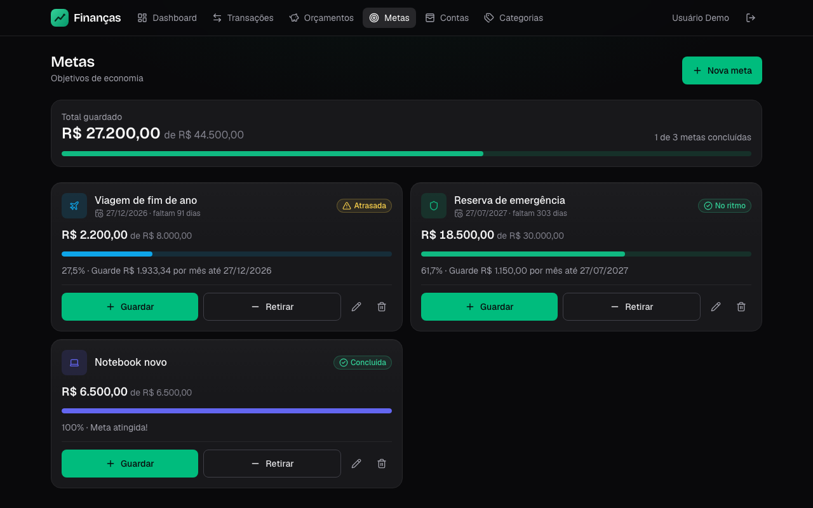
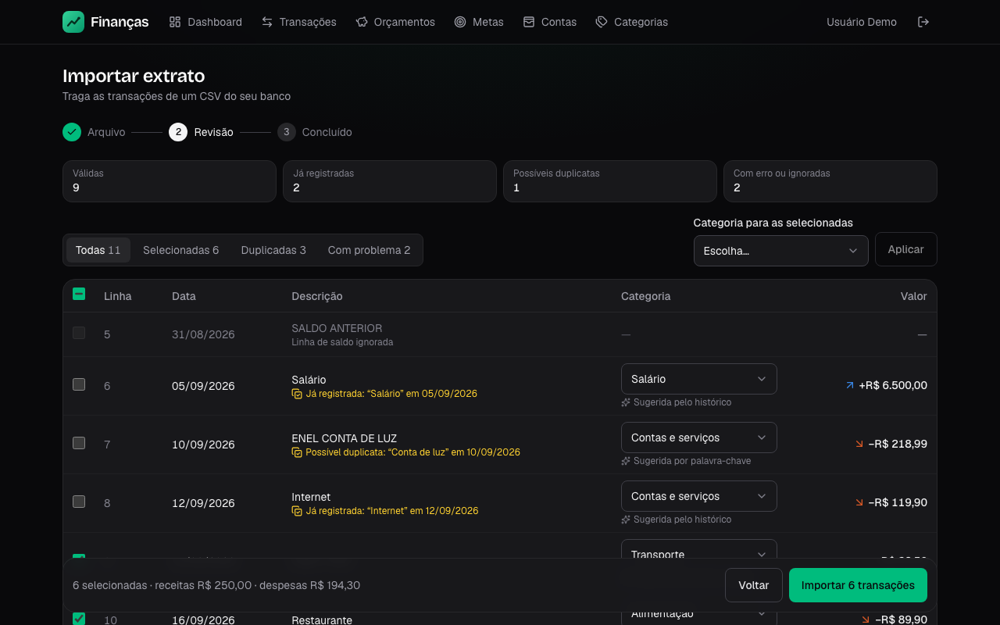

# Gestão Financeira Pessoal

Aplicação web full stack para organizar as finanças pessoais: contas, transações, categorias,
orçamentos por categoria, metas de economia, lançamentos recorrentes, importação de extratos
bancários em CSV e um dashboard com gráficos, tudo com dados isolados por usuário.

**🔗 Projeto no ar: [gestaofinanceira-lake.vercel.app](https://gestaofinanceira-lake.vercel.app)**

> ⏳ A API está hospedada no plano gratuito do Render, que hiberna o serviço após um período sem
> uso. Por isso, **o primeiro acesso pode levar até 50 segundos**; depois disso, a navegação fica
> rápida.

**Acesso de demonstração**

| E-mail              | Senha       |
| ------------------- | ----------- |
| `demo@financas.dev` | `demo12345` |

A conta de demonstração já vem com **12 meses de dados**: três contas, receitas e despesas
categorizadas, lançamentos gerados por recorrências, transferências entre contas, orçamentos e
metas em andamento.



<p align="center">
  
  &nbsp;
  
</p>

| Login                                       | Transações                                       |
| ------------------------------------------- | ------------------------------------------------ |
|         |  |
| **Orçamentos**                              | **Metas**                                        |
|  |              |



## Sumário

- [Stack](#stack)
- [Funcionalidades](#funcionalidades)
- [Decisões técnicas](#decisões-técnicas)
- [Qualidade](#qualidade)
- [Estrutura de pastas](#estrutura-de-pastas)
- [Como rodar localmente](#como-rodar-localmente)
- [Variáveis de ambiente](#variáveis-de-ambiente)
- [Principais endpoints](#principais-endpoints)
- [Deploy](#deploy)
- [Autora](#autora)

## Stack

| Camada         | Tecnologias                                                                                                                             |
| -------------- | --------------------------------------------------------------------------------------------------------------------------------------- |
| Frontend       | React 19, TypeScript, Vite, Tailwind CSS 4, React Router, TanStack Query, React Hook Form + Zod, Recharts, Framer Motion, lucide-react  |
| Backend        | Node.js, TypeScript, Express 5, Prisma 7, Zod, JWT (jsonwebtoken), bcrypt, Multer, csv-parse, Helmet, express-rate-limit                |
| Banco de dados | PostgreSQL (Neon), com migrations do Prisma e extensão `pg_trgm`                                                                        |
| Infraestrutura | API no Render, frontend na Vercel, banco no Neon                                                                                        |
| Testes         | Vitest, Supertest e Testing Library; testes de integração contra PostgreSQL real; auditoria de acessibilidade com axe-core e Playwright |
| Ferramentas    | ESLint, Prettier, tsup, tsx                                                                                                             |

## Funcionalidades

### Transações

- Cadastro, edição e exclusão de receitas e despesas, com categoria, conta e observações.
- Listagem com **paginação no servidor**, filtros por período (mês, intervalo ou tudo), tipo, conta,
  categoria (incluindo "sem categoria") e faixa de valor, busca textual e ordenação por data, valor
  ou descrição. Os totais exibidos consideram todo o resultado filtrado, não só a página.
- Todos os filtros ficam na URL (`/transacoes?mes=2026-09&tipo=despesa&busca=mercado`), então a
  listagem pode ser compartilhada e sobrevive a recarregar a página.
- **Detalhe em painel lateral** (no celular, uma folha que sobe de baixo) com a origem do lançamento:
  manual, importado de CSV (com o nome do arquivo) ou gerado por recorrência. O item aberto também
  fica na URL, e o botão voltar do navegador fecha o painel.
- Campo de valor no estilo de aplicativo de banco (os dígitos entram pelos centavos) e exclusão com
  confirmação, que remove a linha na hora e a devolve se a API falhar.

### Dashboard

- Saldo total, receitas e despesas do mês com variação em relação ao mês anterior e taxa de economia.
- Gráficos de evolução do saldo e de receitas x despesas dos últimos 12 meses, e despesas por
  categoria.
- Cores validadas para daltonismo, uma versão em tabela para cada gráfico e o mês selecionado na URL.

### Orçamentos

- Limite de gasto por categoria e por mês, com valor gasto, restante e percentual consumido.
- Status "Dentro do limite", "Atenção" (a partir de 80%) ou "Estourado", sempre com ícone e texto.
- Gasto fora dos orçamentos do mês e cópia dos orçamentos do mês anterior com um clique.

### Metas

- Metas de economia com valor alvo, valor guardado e prazo opcional.
- Progresso, quanto guardar por mês para chegar no prazo e indicação de "No ritmo", "Atrasada",
  "Prazo vencido" ou "Concluída".
- Depósitos e retiradas, com bloqueio de retirada acima do valor guardado.

### Recorrências

- Modelos semanais, mensais ou anuais (dia 31 vira o último dia dos meses mais curtos), com data de
  início e data final opcional; é possível pausar e retomar.
- As ocorrências vencidas viram transações automaticamente: ao criar ou editar o modelo, por um
  agendador dentro do servidor e por um endpoint manual.
- No app, o detalhe de cada transação gerada mostra a recorrência de origem, com frequência, próxima
  ocorrência e quantidade de lançamentos. A criação e a edição de modelos estão disponíveis pela API.

### Importação de CSV

- Fluxo em três etapas: envio do arquivo, revisão linha a linha e confirmação.
- Leitura de extratos reais de bancos brasileiros: codificação Windows-1252, separador `;`, vírgula
  decimal, `R$`, datas `dd/mm/aaaa`, cabeçalho do banco antes da tabela e linhas de saldo.
- Detecção de **duplicatas** (exatas e possíveis) e **sugestão de categoria** pelo histórico do
  usuário ou por palavras-chave, com possibilidade de trocar a categoria por linha ou em lote.
- Mapeamento manual das colunas quando o arquivo tem um formato desconhecido.

### Contas e transferências

- Carteiras, contas correntes, poupança, cartões e investimentos, com saldo atual calculado a partir
  do saldo inicial (que pode ser negativo, como uma fatura em aberto) e das movimentações.
- Contas com histórico podem ser arquivadas em vez de excluídas.
- Transferências entre contas, com lista das mais recentes, detalhe, edição e exclusão.

### Conta de usuário e experiência

- Cadastro com as 19 categorias padrão já criadas, login com JWT e regras de senha exibidas enquanto
  a pessoa digita.
- Interface em português, tema escuro, layout pensado primeiro para o celular e animações curtas que
  respeitam a preferência do sistema por menos movimento.

## Decisões técnicas

**Valores em centavos inteiros, nunca `float`.** Números de ponto flutuante não representam
exatamente valores como 0,10 (`0.1 + 0.2 !== 0.3`), e esses erros se acumulam em somas. Todo valor
monetário é guardado e calculado como inteiro em centavos; a conversão para reais só acontece na
borda, ao digitar e ao exibir. O parser de CSV converte "1.234,56" para `123456` sem passar por
`float`.

**Isolamento entre usuários garantido pelo banco.** Além de toda consulta filtrar pelo usuário
autenticado, as tabelas se relacionam por **chaves estrangeiras compostas**
(`[account_id, user_id] → accounts[id, user_id]`). Assim, o próprio PostgreSQL rejeita uma transação
que aponte para a conta ou categoria de outro usuário, mesmo que um bug na aplicação tente gravar
isso.

**Constraints `CHECK` para integridade.** Regras que não podem ser violadas ficam no banco: valores
positivos, cores em hexadecimal, dia de recorrência válido para a frequência, data final posterior à
inicial, mês de orçamento sempre no dia 1 e conta de destino diferente da de origem.

**Agregações em SQL, não em memória.** Os números do dashboard e dos orçamentos são calculados pelo
PostgreSQL: `SUM(...) FILTER (WHERE ...)` para receitas e despesas do mês atual e do anterior em uma
única varredura, `generate_series` para incluir meses sem movimento, funções de janela
(`SUM() OVER (ORDER BY mês)`) para o saldo acumulado e `LATERAL` para somar o gasto de cada orçamento.
O Node recebe o resultado pronto, em vez de carregar milhares de linhas.

**Transferências em tabela própria.** Mover dinheiro entre contas não é receita nem despesa. Por isso
as transferências ficam na tabela `transfers`, e não como um tipo de transação: os totais e gráficos
leem apenas `transactions` e não têm como ser inflados por uma transferência, que afeta só os saldos.

**Datas sem fuso e mês atual no fuso da aplicação.** A data de uma transação é um dia do calendário,
guardada no tipo `date` do PostgreSQL, sem horário. O "hoje" e o "mês atual" são calculados no fuso
configurado (`America/Sao_Paulo`), e não no relógio UTC do servidor: às 22h do último dia do mês, o
app ainda mostra o mês certo.

**Recorrências sem duplicação.** Cada execução do gerador "reserva" o modelo com um
`UPDATE ... WHERE last_run_date = <valor lido>` dentro de uma transação. O `UPDATE` trava a linha, então
uma execução concorrente espera e depois não encontra nada a gerar. Um índice único em
`(recurring_transaction_id, date)` é a segunda barreira. Como a geração sempre começa depois da
última data processada, uma ocorrência excluída de propósito não é recriada.

**Advisory lock na importação de CSV.** A confirmação roda dentro de uma transação com
`pg_advisory_xact_lock` por conta e revalida as duplicatas. Um duplo clique em "Importar" ou duas
abas confirmando ao mesmo tempo não duplicam os lançamentos: a segunda confirmação espera a primeira
e encontra tudo já registrado.

**Depósitos e retiradas atômicos nas metas.** Cada movimentação é um único
`UPDATE ... SET current = current ± valor` com a condição no `WHERE` (por exemplo, saldo suficiente
para a retirada). Requisições simultâneas não sobrescrevem umas às outras e a meta nunca fica
negativa.

**Paginação com ordenação determinística.** A ordenação escolhida pelo usuário é sempre desempatada
pelo id (UUIDv7, que é ordenado pelo tempo). Sem isso, registros com o mesmo valor ou a mesma data
poderiam aparecer repetidos em duas páginas ou sumir entre elas. Os campos de ordenação vêm de uma
lista permitida.

**Busca textual com índice trigram e escape de curingas.** A busca usa `ILIKE '%termo%'`, acelerada por
índices GIN com `pg_trgm` na descrição e nas observações. Os caracteres `%` e `_` digitados pelo
usuário são escapados: sem isso, buscar "50%" ou "%" retornaria todas as transações.

## Qualidade

| Área     | Testes  | O que cobrem                                                |
| -------- | ------- | ----------------------------------------------------------- |
| Backend  | **185** | 147 unitários e 38 de integração                            |
| Frontend | **130** | Componentes, páginas e fluxos completos com Testing Library |

- **Integração contra PostgreSQL real.** Os testes de integração rodam em um banco separado e
  descartável, migrado e limpo automaticamente a cada execução, e cobrem saldos e agregações, geração
  de recorrências (inclusive com execuções concorrentes), o fluxo de importação e o isolamento entre
  usuários (acesso, listagem e referência a dados de outra pessoa, inclusive direto no banco).
- **Testes validados por mutação.** Defeitos foram introduzidos de propósito no código (remover a
  trava das recorrências, o advisory lock da importação, o filtro por usuário de uma consulta) para
  confirmar que os testes correspondentes falham. Esse processo revelou um teste de concorrência que
  não exercitava concorrência de verdade, que foi corrigido.
- **Acessibilidade WCAG 2.1 AA.** Auditoria automática com axe-core em todas as telas, inclusive com
  diálogos e painéis abertos, sem violações. Diálogos com foco preso e devolvido a quem os abriu,
  navegação por teclado com foco visível, rótulos para leitores de tela e cor nunca como único sinal.
- **Verificação no navegador.** As telas foram conferidas em um navegador real (Chromium com
  Playwright), em desktop e celular, com os dados de demonstração.
- **Padronização.** TypeScript em modo estrito, ESLint e Prettier nos dois projetos e commits no
  padrão Conventional Commits.

## Estrutura de pastas

```
.
├── backend/
│   ├── prisma/
│   │   ├── schema.prisma        # modelagem do banco
│   │   ├── migrations/          # migrations versionadas (com constraints CHECK e índices)
│   │   └── seed.ts              # usuário de demonstração com 12 meses de dados
│   ├── src/
│   │   ├── controllers/         # entrada das rotas: valida e chama os services
│   │   ├── services/            # regras de negócio e consultas
│   │   ├── routes/              # definição dos endpoints
│   │   ├── schemas/             # validação com Zod
│   │   ├── middlewares/         # autenticação, erros, upload, rate limit
│   │   ├── jobs/                # agendador das recorrências
│   │   ├── utils/               # dinheiro, datas, recorrência, parser de CSV...
│   │   ├── app.ts               # configuração do Express
│   │   └── server.ts            # inicialização
│   └── tests/
│       ├── unit/                # sem banco
│       └── integration/         # contra PostgreSQL real
├── frontend/
│   └── src/
│       ├── pages/               # uma página por rota
│       ├── components/          # por área (dashboard, transações, importação...) e ui/ genéricos
│       ├── hooks/               # dados (TanStack Query), filtros na URL, diálogos
│       ├── services/            # cliente HTTP e chamadas à API
│       ├── contexts/            # autenticação e avisos
│       ├── utils/               # formatação, regras de senha, filtros, animações
│       └── types/               # tipos das respostas da API
├── docs/screenshots/            # imagens deste README
└── render.yaml                  # configuração opcional do serviço no Render
```

## Como rodar localmente

### Pré-requisitos

- Node.js 22.12 ou superior (o projeto usa a versão 24)
- Um banco PostgreSQL, local ou gratuito no [Neon](https://neon.tech)

### Backend

```bash
cd backend
cp .env.example .env     # preencha DATABASE_URL, DIRECT_URL e JWT_SECRET
npm install              # também gera o Prisma Client
npm run db:migrate       # aplica as migrations
npm run db:seed          # cria o usuário de demonstração
npm run dev              # API em http://localhost:3333/api
```

### Frontend

```bash
cd frontend
cp .env.example .env
npm install
npm run dev              # app em http://localhost:5173
```

Entre com `demo@financas.dev` / `demo12345` ou crie uma conta.

### Scripts úteis

| Onde    | Script                     | O que faz                                          |
| ------- | -------------------------- | -------------------------------------------------- |
| ambos   | `npm run dev`              | Ambiente de desenvolvimento                        |
| ambos   | `npm run build`            | Build de produção                                  |
| ambos   | `npm test`                 | Todos os testes                                    |
| ambos   | `npm run lint`             | ESLint                                             |
| ambos   | `npm run typecheck`        | Checagem de tipos                                  |
| backend | `npm run test:unit`        | Só os testes unitários (não precisam de banco)     |
| backend | `npm run test:integration` | Testes de integração (usam `DATABASE_URL_TEST`)    |
| backend | `npm run db:migrate`       | Cria e aplica migrations em desenvolvimento        |
| backend | `npm run db:deploy`        | Aplica migrations pendentes (produção)             |
| backend | `npm run db:seed`          | Recria o usuário de demonstração                   |
| backend | `npm run db:studio`        | Abre o Prisma Studio                               |
| backend | `npm run jobs:recurring`   | Gera as recorrências vencidas de todos os usuários |

## Variáveis de ambiente

### Backend (`backend/.env`)

| Variável                         | Obrigatória    | Descrição                                                                                                                            |
| -------------------------------- | -------------- | ------------------------------------------------------------------------------------------------------------------------------------ |
| `DATABASE_URL`                   | sim            | Conexão com o PostgreSQL usada pela API (no Neon, a URL com pooler)                                                                  |
| `DIRECT_URL`                     | recomendada    | Conexão direta, usada pelas migrations (no Neon, a URL sem pooler)                                                                   |
| `JWT_SECRET`                     | sim            | Segredo dos tokens, com 32 caracteres ou mais                                                                                        |
| `CORS_ORIGIN`                    | em produção    | Origens permitidas, separadas por vírgula; aceita `*` em subdomínio (ex.: previews da Vercel). Padrão local: `http://localhost:5173` |
| `NODE_ENV`                       | não            | `development` (padrão) ou `production`                                                                                               |
| `PORT`                           | não            | Porta da API (padrão `3333`; no Render, definida automaticamente)                                                                    |
| `JWT_EXPIRES_IN`                 | não            | Validade do token (padrão `1d`)                                                                                                      |
| `BCRYPT_SALT_ROUNDS`             | não            | Custo do hash de senha (padrão `10`)                                                                                                 |
| `APP_TIMEZONE`                   | não            | Fuso usado para "hoje" e o mês atual (padrão `America/Sao_Paulo`)                                                                    |
| `RECURRING_JOB_INTERVAL_MINUTES` | não            | Intervalo do agendador de recorrências (padrão `60`; `0` desliga)                                                                    |
| `DATABASE_URL_TEST`              | só para testes | Banco separado e descartável dos testes de integração (o nome precisa conter `test`)                                                 |

### Frontend (`frontend/.env`)

| Variável       | Obrigatória      | Descrição                                                                                                 |
| -------------- | ---------------- | --------------------------------------------------------------------------------------------------------- |
| `VITE_API_URL` | sim, em produção | Endereço da API com `/api` (padrão local: `http://localhost:3333/api`). O build de produção falha sem ela |

## Principais endpoints

Todas as rotas ficam sob `/api`. As autenticadas exigem o cabeçalho `Authorization: Bearer <token>`.
Os erros seguem o formato `{ "message": string, "details"?: { campo: string[] } }`.

| Método                     | Rota                               | Acesso      | Descrição                                                                          |
| -------------------------- | ---------------------------------- | ----------- | ---------------------------------------------------------------------------------- |
| `GET`                      | `/health`                          | público     | Verificação de saúde da API                                                        |
| `POST`                     | `/auth/register`                   | público     | Cadastro (cria as 19 categorias padrão)                                            |
| `POST`                     | `/auth/login`                      | público     | Login; retorna o usuário e o token                                                 |
| `GET`                      | `/auth/me`                         | autenticado | Usuário da sessão                                                                  |
| `GET` · `POST`             | `/transactions`                    | autenticado | Lista paginada com filtros, busca e ordenação · cria transação                     |
| `GET` · `PATCH` · `DELETE` | `/transactions/:id`                | autenticado | Detalhe · edição · exclusão                                                        |
| `GET` · `POST`             | `/accounts`                        | autenticado | Contas com saldo atual · cria conta                                                |
| `GET` · `PATCH` · `DELETE` | `/accounts/:id`                    | autenticado | Detalhe · edição e arquivamento · exclusão (só sem movimentações)                  |
| `GET` · `POST`             | `/categories`                      | autenticado | Lista (filtro por tipo) · cria categoria                                           |
| `GET` · `PATCH` · `DELETE` | `/categories/:id`                  | autenticado | Detalhe · edição · exclusão, com opção de mover as transações para outra categoria |
| `GET` · `POST`             | `/transfers`                       | autenticado | Lista paginada · transfere entre contas                                            |
| `GET` · `PATCH` · `DELETE` | `/transfers/:id`                   | autenticado | Detalhe · edição · exclusão                                                        |
| `GET` · `POST`             | `/recurring-transactions`          | autenticado | Modelos com a próxima ocorrência · cria modelo e gera as ocorrências vencidas      |
| `POST`                     | `/recurring-transactions/generate` | autenticado | Gera as ocorrências vencidas do usuário (pode ser chamado repetidamente)           |
| `GET` · `PATCH` · `DELETE` | `/recurring-transactions/:id`      | autenticado | Detalhe · edição, pausa e retomada · exclusão                                      |
| `GET` · `POST`             | `/budgets`                         | autenticado | Orçamentos do mês com consumo e status · cria orçamento                            |
| `POST`                     | `/budgets/copy`                    | autenticado | Copia os orçamentos de um mês para outro                                           |
| `GET` · `PATCH` · `DELETE` | `/budgets/:id`                     | autenticado | Detalhe · altera o limite · exclusão                                               |
| `GET` · `POST`             | `/goals`                           | autenticado | Metas com progresso · cria meta                                                    |
| `GET` · `PATCH` · `DELETE` | `/goals/:id`                       | autenticado | Detalhe · edição · exclusão                                                        |
| `POST`                     | `/goals/:id/deposit`               | autenticado | Guarda um valor na meta                                                            |
| `POST`                     | `/goals/:id/withdraw`              | autenticado | Retira um valor da meta                                                            |
| `GET`                      | `/dashboard/summary`               | autenticado | Saldo total e totais do mês e do mês anterior                                      |
| `GET`                      | `/dashboard/monthly-evolution`     | autenticado | Receitas, despesas e saldo de fechamento por mês                                   |
| `GET`                      | `/dashboard/by-category`           | autenticado | Total e percentual por categoria, no mês ou em um período                          |
| `POST`                     | `/imports/preview`                 | autenticado | Envio do CSV (multipart) e prévia com duplicatas e categorias sugeridas            |
| `POST`                     | `/imports/confirm`                 | autenticado | Importa as linhas revisadas                                                        |

Login e cadastro têm limite de 20 tentativas a cada 15 minutos por IP.

## Deploy

| Serviço  | Plataforma | Configuração                                                                                                                         |
| -------- | ---------- | ------------------------------------------------------------------------------------------------------------------------------------ |
| API      | Render     | Root `backend` · Build `npm ci --include=dev && npm run build && npm run db:deploy` · Start `npm start` · Health check `/api/health` |
| Frontend | Vercel     | Root `frontend` · Preset Vite · Build `npm run build` · Output `dist` (rotas do app configuradas em `frontend/vercel.json`)          |
| Banco    | Neon       | Connection string com pooler em `DATABASE_URL` e direta em `DIRECT_URL`                                                              |

As migrations pendentes são aplicadas a cada deploy da API por `prisma migrate deploy`. Em produção, a
API não inicia sem `CORS_ORIGIN`, e o build do frontend não conclui sem `VITE_API_URL`, para que uma
configuração faltando apareça no deploy e não no navegador de quem usa.

## Autora

**Maria Carolina Magnani de Lyra**

- GitHub: [github.com/carollyra](https://github.com/carollyra)
- LinkedIn: [linkedin.com/in/carolina-magnani-383141353](https://www.linkedin.com/in/carolina-magnani-383141353)
